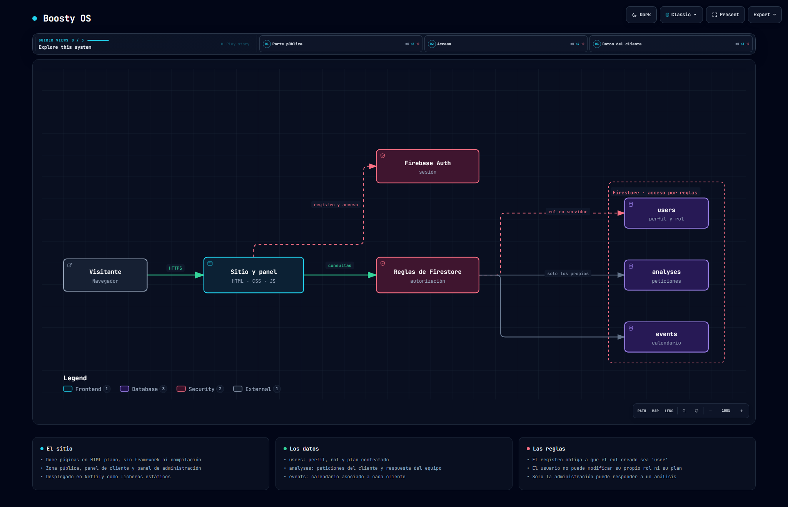

# Boosty OS

Sitio corporativo con área privada: página pública de servicios y precios, registro de clientes,
panel donde el cliente pide análisis y consulta su calendario, y panel de administración para
responderlos.

Desarrollado para cliente · HTML, CSS y JavaScript · Firebase



> Diagrama generado con [Archify](https://github.com/tt-a1i/archify) a partir del código de este
> repositorio. Especificación en [`docs/arquitectura.architecture.json`](docs/arquitectura.architecture.json);
> versión navegable en [`docs/arquitectura.html`](docs/arquitectura.html).

---

## Sin framework y sin servidor

Doce páginas HTML servidas tal cual, con su CSS y su JavaScript. No hay compilación, ni
`node_modules`, ni proceso de despliegue: los ficheros que están en el repositorio son exactamente
los que llegan al navegador.

Para una web corporativa con un área privada modesta eso se sostiene bien — el coste de
mantenimiento es bajo y no hay cadena de dependencias que se rompa sola con el tiempo.

| Zona | Páginas |
|---|---|
| Pública | Inicio, servicios, planes y precios, agencias, casos reales, cómo funciona, FAQ, legal |
| Acceso | Registro e inicio de sesión |
| Privada | Panel de cliente y panel de administración |

## Toda la autorización está en las reglas

Como no hay servidor propio, el navegador habla directamente con Firestore. Eso significa que
[`firestore.rules`](firestore.rules) no es una capa más: **es la única**. Tres decisiones que la
sostienen:

**Nadie puede registrarse como administrador.** La regla de creación exige que el rol del documento
nuevo sea exactamente `user`:

```js
allow create: if isOwner(userId) && request.resource.data.role == 'user';
```

**Y nadie puede ascenderse después.** La actualización rechaza la escritura si entre los campos
tocados aparece `role` o `plan`:

```js
allow update: if (isOwner(userId) &&
  !request.resource.data.diff(resource.data).affectedKeys().hasAny(['role', 'plan']))
  || isAdmin();
```

Fíjate en que es **una sola sentencia** con las dos vías dentro. En Firestore las reglas `allow` se
combinan con O, así que una condición restrictiva escrita aparte no restringe nada: tiene que ir
unida a la permisiva.

**El rol se lee del servidor,** no de lo que diga el cliente:

```js
function isAdmin() {
  return isAuthenticated() &&
    exists(/databases/$(database)/documents/users/$(request.auth.uid)) &&
    get(/databases/$(database)/documents/users/$(request.auth.uid)).data.role == 'admin';
}
```

## Las colecciones

| Colección | Contenido | Quién accede |
|---|---|---|
| `users` | Perfil, rol y plan | El propio usuario o administración |
| `analyses` | Peticiones de análisis y su respuesta | Su autor lee; solo administración responde |
| `events` | Calendario del cliente | Su dueño o administración |

Tanto `analyses` como `events` llevan el `userId` dentro del documento, y las reglas comparan ese
campo con `request.auth.uid`. Por eso las consultas del cliente tienen que filtrar por su propio
identificador: Firestore rechaza cualquier consulta que no pueda demostrar de antemano que devuelve
solo filas permitidas.

## Estructura

```
WEB/
├── index.html  servicios.html  planes-precios.html
├── agencias.html  casos-reales.html  como-funciona.html
├── faq.html  legal.html
├── login.html  register.html
├── dashboard.html  admin.html
├── css/          una hoja por página más style.css y animations.css
├── js/
│   ├── firebase-config.js   inicialización
│   ├── login.js  register.js
│   ├── dashboard.js         panel de cliente
│   ├── admin.js             panel de administración
│   └── main.js  index.js  animations.js
└── netlify.toml
firestore.rules
```

## Puesta en marcha

Es un sitio estático: basta con servir la carpeta `WEB/`.

```bash
npx serve WEB
```

Hay que rellenar la configuración de Firebase en `WEB/js/firebase-config.js` y desplegar
[`firestore.rules`](firestore.rules) en el proyecto correspondiente.
